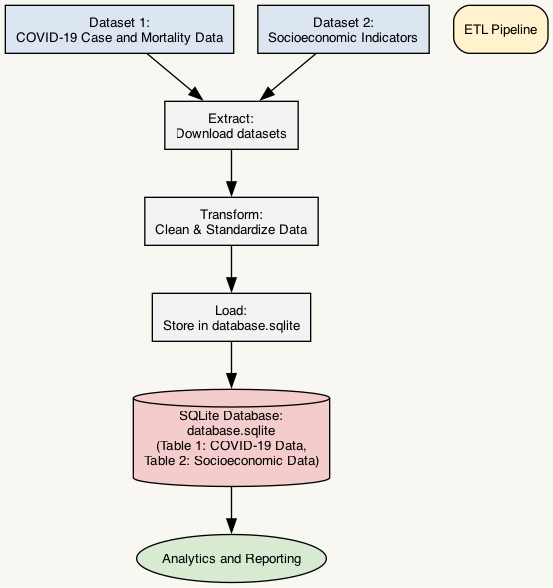

# Project Work 4 - Data Report

## Title
**Socioeconomic Factors and Healthcare Burden during COVID-19 in the Americas**

## Main Question
How did socioeconomic factors (e.g., GDP per capita, healthcare expenditure) correlate with COVID-19 outcomes (e.g., mortality and ICU occupancy rates) in the Americas?

## Description
This project investigates the relationship between socioeconomic factors and healthcare burdens during the COVID-19 pandemic in countries across the Americas. By focusing on publicly available data, it aims to answer a critical question: How did differences in economic development and healthcare investments impact outcomes such as mortality rates and ICU strain? The goal is to provide insights that may guide policy decisions in public health and resource allocation.

---

## Data Sources Overview

| Datasource   | License         | Filetype      | Accuracy                                      | Completeness                   | Consistency | Timeliness | Relevancy |
|--------------|-----------------|---------------|----------------------------------------------|--------------------------------|-------------|------------|-----------|
| COVID-19 Case and Mortality Data | Open License ([details](https://github.com/CSSEGISandData/COVID-19#license)) | CSV           | Data is aggregated daily from multiple sources, potential discrepancies | Some missing data due to reporting inconsistencies | Yes         | Yes        | Yes       |
| Socioeconomic Indicators       | Open Data License ([details](https://data.worldbank.org/summary-terms-of-use)) | CSV           | Highly accurate, regularly updated            | Some missing data for smaller countries          | Yes         | Yes        | Yes       |

---

## Data Sources

### Datasource1: COVID-19 Case and Mortality Data
- **Metadata URL**: [COVID-19 Data Repository by CSSE at Johns Hopkins University](https://github.com/CSSEGISandData/COVID-19)
- **Data URL**: [Time-Series Confirmed Cases](https://github.com/CSSEGISandData/COVID-19/blob/master/csse_covid_19_data/csse_covid_19_time_series/time_series_covid19_confirmed_global.csv)
- **Data Type**: CSV
- **Description**: Provides time-series data on confirmed cases, deaths, and recoveries by country.
- **Structure and Quality**:  
  - **Structure**: Rows represent countries and dates, columns include case counts, deaths, and recoveries.
  - **Quality**: Data is collected daily and aggregated from multiple sources; potential discrepancies due to reporting delays or inconsistencies.
- **License**: Openly available under the repository's license. Details can be found [here](https://github.com/CSSEGISandData/COVID-19#license).
- **Compliance Plan**: Use data attribution in reports and ensure compliance by referencing the license URL in the final documentation.

### Datasource2: Socioeconomic Indicators
- **Metadata URL**: [World Bank Open Data](https://data.worldbank.org)
- **Data URL**: [GDP Per Capita and Other Indicators](https://data.worldbank.org/indicator/NE.GDI.TOTL.ZS)
- **Data Type**: CSV
- **Description**: Offers data on GDP per capita, healthcare expenditure, and other economic metrics.
- **Structure and Quality**:  
  - **Structure**: Rows represent countries and columns include socioeconomic metrics like GDP per capita and healthcare spending.
  - **Quality**: Regularly updated, with historical data available. Missing data for some countries or years is possible.
- **License**: Open Data License from the World Bank. Details are available [here](https://data.worldbank.org/summary-terms-of-use).
- **Compliance Plan**: Acknowledge the World Bank as the source and include license details in the project documentation.

---

## Data Pipeline

### Overview
The data pipeline was designed to automate the extraction, transformation, and loading (ETL) process for both data sources. The following technologies were used:
- **Programming Language**: Python
- **Libraries**: Pandas, NumPy, and Matplotlib for processing and visualization.
- **Automation Tools**: Apache Airflow for scheduling data updates.

### Data Pipeline Visualization
Below is the ETL pipeline visualization for this project:

  

### Data Transformation and Cleaning Steps
1. **COVID-19 Data**:  
   - Removed irrelevant columns (e.g., global totals).
   - Aggregated data by country and normalized values based on population.
   - Addressed missing values by interpolation.

2. **Socioeconomic Data**:  
   - Filtered for relevant indicators (GDP, healthcare spending).
   - Merged datasets using ISO country codes.
   - Standardized metrics for comparison across countries.

### Problems and Solutions
- **Data Format Inconsistencies**: Resolved using custom Python scripts to standardize CSV formats.
- **Missing Data**: Imputed missing values using statistical methods (e.g., mean or median substitution).

### Meta-Quality Measures
- Automated error detection during ETL to flag anomalies.
- Pipeline checks for data freshness and integrity before transformation.

---

## Results and Limitations

### Output Data
- **Structure and Quality**: Cleaned and merged dataset includes country-level COVID-19 outcomes and socioeconomic indicators.
- **Format**: Output saved as a CSV file to maintain compatibility with analysis tools.
- **Quality**: Verified against source data to ensure accuracy, with annotations for imputed values.

### Critical Reflection
- **Strengths**: Automated pipeline ensures reproducibility and scalability for future data updates.
- **Limitations**:  
  - Missing data for some smaller nations affects the comprehensiveness of the analysis.
  - Correlation does not imply causation; further studies are required to establish causality.

---

